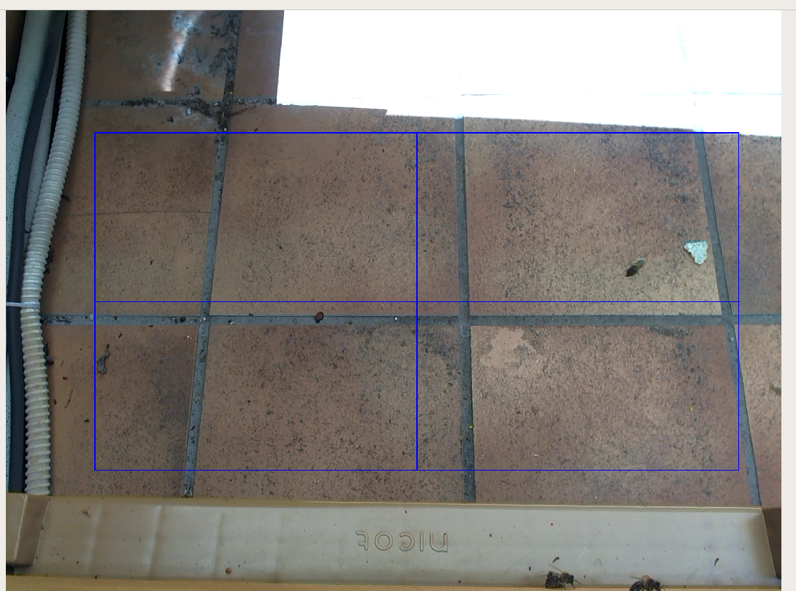
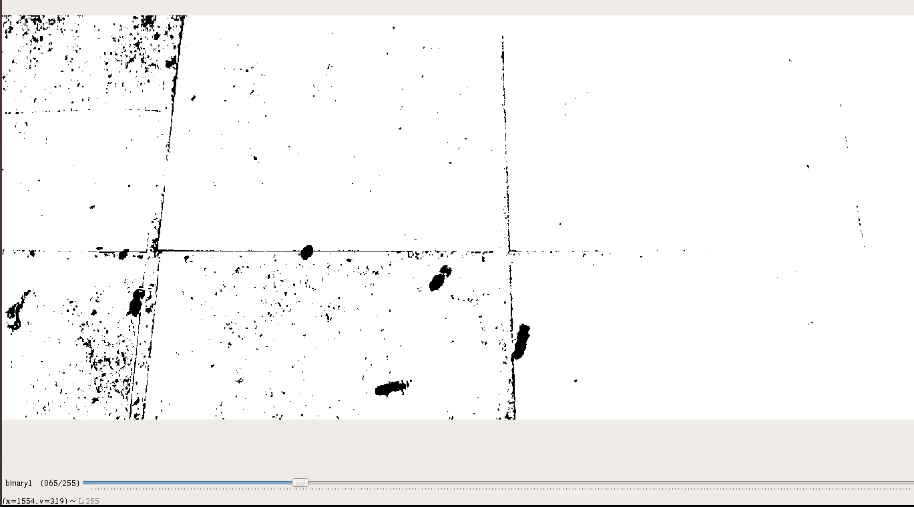
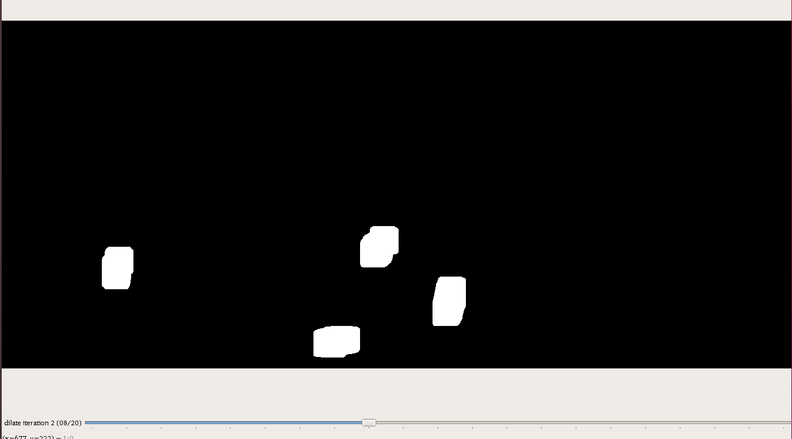
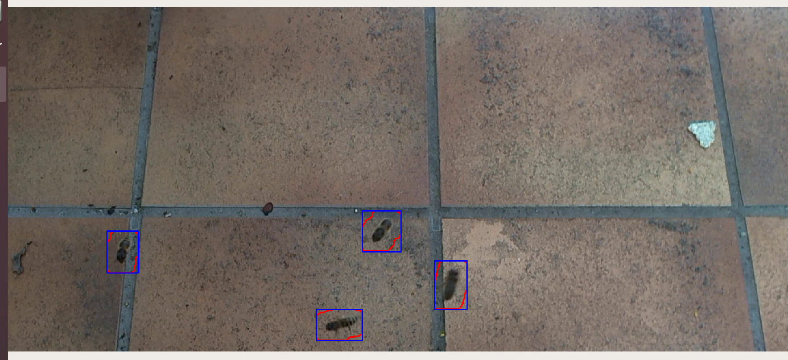
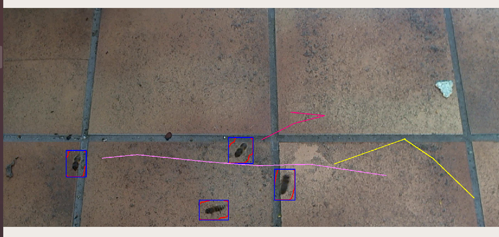
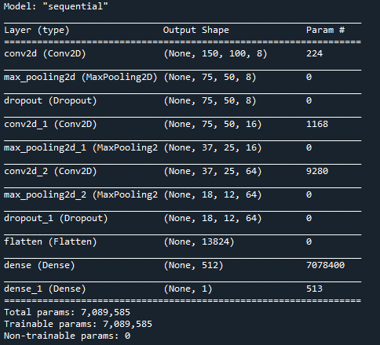
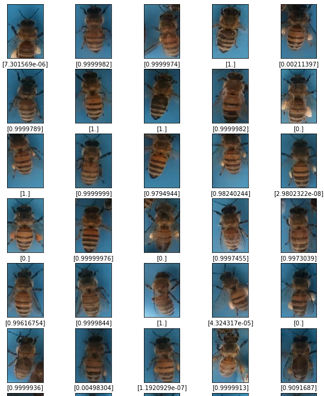
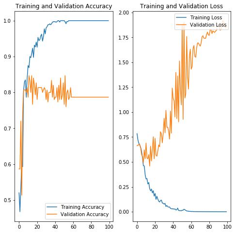

# BeeDetection

## Objectifs 

A partir d'une vidéo déja réalisée ou en streaming de la zone d'entrée de la ruche :
- compter les entrées/sorties d'abeilles,
- compter les varroa sur les abeilles en vol pour en déduire un % d'infestation sans perturber la colonie,

- détecter, caractériser et quantifier le pollen.

	
## Fonctions principales

En Python 3 openCV
	
- la détection des abeilles en vol *- ok*

selection du ROI (Region Of Interest) :

Aprés 1ere binarisation :

Aprés suppression du bruit de fond (gaussian, dilate) et soustraction de l'image précédente pour garder que ce qui est en mouvement :

Détection des contours :

- le tracking 

Reprise du code sur : <https://github.com/srianant/kalman_filter_multi_object_tracking>

- l'identification

- détection varroa

- détection pollen

Apprentissage par reseau de neurones à convolution avec TensorFlow/keras.
Premier dataset : <https://github.com/piperod/PollenDataset>
Dataset perso a refaire sur fond blanc au printemps :<https://github.com/Rastafouille/PollenDataSet> 

Caractéristique du réseau et dataset :

- classification pollen

## Installation dépendances pour Ubuntu 18.04

`sudo apt-get update`

`sudo apt-get upgrade`

`sudo apt install python3`

`sudo apt-get install build-essential cmake unzip pkg-config libjpeg-dev libpng-dev libtiff-dev libavcodec-dev libavformat-dev libswscale-dev libv4l-dev libxvidcore-dev libx264-dev libgtk-3-dev libatlas-base-dev gfortran`

`sudo apt-get install python3-dev`

`wget https://bootstrap.pypa.io/get-pip.py`

`sudo python3 get-pip.py`

`sudo pip install spyder opencv-python opencv-contrib-python`

`python -m pip install --user numpy scipy matplotlib ipython jupyter pandas sympy nose`

tensorflow

